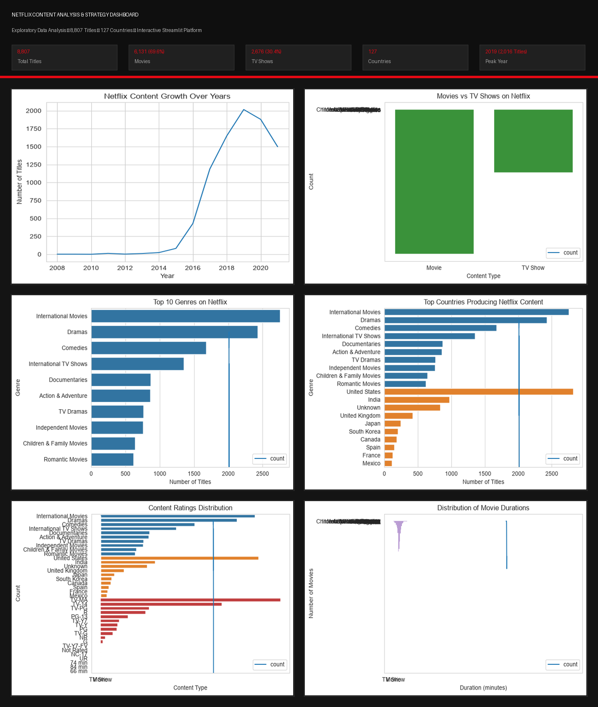
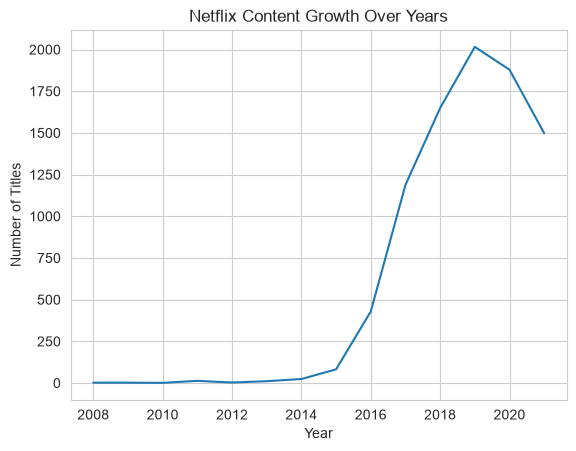
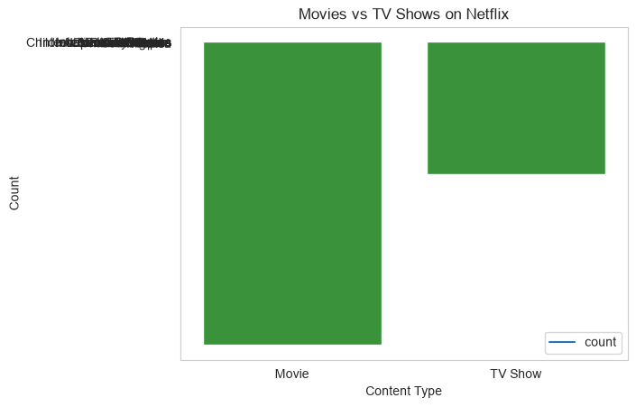
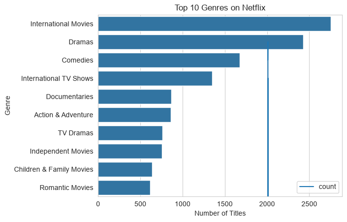
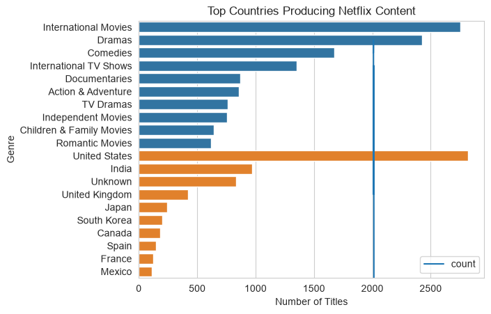
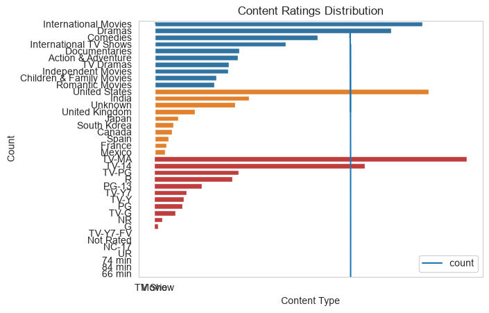
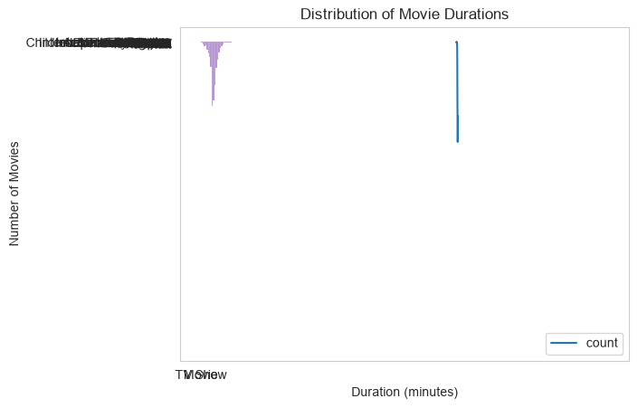

<div align="center">

# 🎬 Netflix Content Analysis

### An Interactive Data Analytics Dashboard built with Python & Streamlit

[](https://python.org)
[](https://streamlit.io)
[](https://pandas.pydata.org)
[](https://plotly.com)
[](LICENSE)
[](https://github.com/Sanoj-936/netflix-content-analysis)

**[📊 View on GitHub](https://github.com/Sanoj-936/netflix-content-analysis)** · **[🚀 Live Dashboard](#-live-demo)** · **[📖 Documentation](#-installation)**

</div>

---

## 📌 Overview

This project performs a comprehensive **Exploratory Data Analysis (EDA)** on Netflix's global content catalog — covering 8,807 titles across 127 countries. The insights are surfaced through an interactive **Streamlit web dashboard** that enables real-time filtering, multi-dimensional exploration, and strategic content analysis.

The analysis investigates key business questions about Netflix's content strategy:

- How has the Netflix library grown year-over-year since 2008?
- What is the platform's balance between Movies and TV Shows?
- Which genres and countries dominate the catalog?
- How are titles distributed across maturity ratings?
- What patterns emerge in movie runtimes and series longevity?

---

## 🚀 Live Demo

> 🌐 **Live Dashboard:** [Open Netflix Content Analysis Dashboard](https://netflix-content-analysis-sanoj936.streamlit.app/)

---

## 🖼️ Dashboard Preview



---

## 📊 Key Insights

| Finding | Detail |
|---|---|
| **Content Split** | 69.6% Movies (6,131 titles) vs. 30.4% TV Shows (2,676 titles) |
| **Peak Growth Year** | 2019 — 2,016 titles added in a single year |
| **Top Producing Country** | United States (3,689 titles), followed by India (1,046) and UK (804) |
| **Most Common Genre** | International Movies (2,752), Dramas (2,427), Comedies (1,674) |
| **Typical Movie Runtime** | 80–120 minutes (mean ≈ 99.6 min) |
| **TV Show Longevity** | 67%+ of series end after Season 1 |
| **Most Common Rating** | TV-MA (most titles) — skewing toward mature audiences |
| **International Growth** | Non-English content is among the fastest-growing genre buckets |

---

## ✨ Features

### 🎛️ Interactive Dashboard (Streamlit)
- **Executive KPI Scorecard** — total titles, Movies %, TV Shows %, active countries, unique genres
- **Sidebar Filters** — filter by content type, release year range, genre, rating, and free-text search (title/cast)
- **Filtered CSV Export** — download any filtered view as a CSV file
- **Responsive Layout** — wide-format, tab-organized dashboard

### 📈 Visualizations (Plotly Interactive)
- **Content Distribution** — donut chart + bar chart for Movies vs. TV Shows breakdown
- **Growth Trends** — year-over-year content additions (area chart) + monthly seasonality
- **Geographic Analysis** — top 15 producing countries (horizontal bar chart)
- **Genre Dynamics** — top 15 genres by volume
- **Duration & Ratings** — movie runtime histogram, TV series season distribution, rating breakdown
- **Data Explorer** — searchable, paginated data table with per-record detail view

### 📓 Jupyter EDA Notebook
- End-to-end exploratory analysis with Matplotlib & Seaborn
- Covers: data cleaning, missing value handling, univariate/multivariate analysis
- Exports 7 publication-quality static charts to `images/`

---

## 📁 Dataset

| Attribute | Value |
|---|---|
| **Name** | Netflix Movies and TV Shows |
| **Source** | Flixable / Kaggle |
| **Records** | 8,807 titles |
| **Columns** | 12 raw features |
| **Release Years** | 1925 – 2021 |
| **Countries** | 127 unique production countries |

**Key Columns:**

| Column | Description |
|---|---|
| `show_id` | Unique title identifier |
| `type` | `Movie` or `TV Show` |
| `title` | Title name |
| `director` | Director(s) — 2,634 missing, imputed as `Unknown` |
| `cast` | Main cast members — 825 missing, imputed as `Unknown` |
| `country` | Production country — 831 missing, imputed as `Unknown` |
| `date_added` | Date added to Netflix platform |
| `release_year` | Original release year |
| `rating` | Maturity rating (TV-MA, TV-14, PG-13, R, etc.) |
| `duration` | Runtime (minutes for Movies, seasons for TV Shows) |
| `listed_in` | Genre category tags (comma-separated) |
| `description` | Editorial synopsis |

---

## 🛠️ Tech Stack

| Layer | Technology |
|---|---|
| **Language** | Python 3.11 |
| **Data Wrangling** | Pandas, NumPy |
| **Interactive Viz** | Plotly Express, Plotly Graph Objects |
| **Static Viz (Notebook)** | Matplotlib, Seaborn |
| **Dashboard Framework** | Streamlit |
| **Notebook Environment** | Jupyter Notebook |
| **Version Control** | Git, GitHub |

---

## 📂 Project Structure

```text
netflix-content-analysis/
│
├── assets/                          # README visual assets
│   ├── dashboard.png                # Dashboard preview banner
│   └── dashboard_overview.png       # Multi-chart analytics overview
│
├── data/
│   └── netflix_titles.csv           # Source dataset (8,807 records, 3.4 MB)
│
├── images/                          # Exported EDA charts
│   ├── movie_duration.png
│   ├── movies_vs_tvshows.png
│   ├── netflix_growth.png
│   ├── rating_distribution.png
│   ├── top_countries.png
│   ├── top_director.png
│   └── top_genres.png
│
├── notebooks/
│   └── netflix_analysis.ipynb       # Exploratory Data Analysis notebook
│
├── src/
│   ├── __init__.py
│   └── data_processing.py           # Reusable ETL and analytics module
│
├── .gitignore                       # Git ignore rules
├── .python-version                  # Python 3.11 runtime pin
├── LICENSE                          # MIT License
├── README.md                        # Project documentation
├── app.py                           # Streamlit dashboard application
└── requirements.txt                 # Project dependencies
```

---

## 📷 Analysis Snapshots

| Content Growth | Movies vs. TV Shows | Top Genres |
|:---:|:---:|:---:|
|  |  |  |

| Top Countries | Content Ratings | Movie Duration |
|:---:|:---:|:---:|
|  |  |  |

---

## 💻 Installation

### Prerequisites
- Python 3.11+
- Git

### Clone and Setup

```bash
# 1. Clone the repository
git clone https://github.com/Sanoj-936/netflix-content-analysis.git
cd netflix-content-analysis
```

**Windows (PowerShell):**
```powershell
# 2. Create virtual environment
python -m venv .venv

# 3. Activate it
.\.venv\Scripts\Activate.ps1

# 4. Install dependencies
pip install --upgrade pip
pip install -r requirements.txt
```

**macOS / Linux:**
```bash
python3 -m venv .venv
source .venv/bin/activate
pip install --upgrade pip
pip install -r requirements.txt
```

---

## ▶️ Run Locally

```bash
streamlit run app.py
```

The dashboard will automatically open in your browser at:
```
http://localhost:8501
```

### Run the EDA Notebook

```bash
jupyter notebook notebooks/netflix_analysis.ipynb
```

---

## ☁️ Deploy to Streamlit Community Cloud

1. Fork this repository to your GitHub account.
2. Visit [share.streamlit.io](https://share.streamlit.io/) and log in with GitHub.
3. Click **"New app"** and configure:
   - **Repository:** `Sanoj-936/netflix-content-analysis`
   - **Branch:** `main`
   - **Main file path:** `app.py`
4. Click **"Deploy!"** — Streamlit Cloud auto-detects `requirements.txt` and `.python-version`.

The app will be live at a URL such as:
```
https://netflix-content-analysis-sanoj936.streamlit.app/
```

---

## 📦 Dependencies

```
pandas>=2.0.0
numpy>=1.24.0
matplotlib>=3.7.0
seaborn>=0.12.0
plotly>=5.15.0
streamlit>=1.30.0
```

---

## 🔮 Future Improvements

- [ ] **IMDb/RT Integration** — Enrich catalog with external audience and critic scores via OMDb API
- [ ] **Sentiment Analysis** — Apply NLP to editorial descriptions to classify thematic tone by genre
- [ ] **Content Recommender** — Build a TF-IDF + cosine-similarity content-based filtering engine
- [ ] **Cast Network Graph** — Visualize frequent actor collaboration clusters

---

## 📄 License

This project is licensed under the [MIT License](LICENSE).

---

## 👨‍💻 Author

**Sanoj Kumar**

[](https://github.com/Sanoj-936)

---

<div align="center">
<sub>Built with ❤️ using Python, Pandas, Plotly, and Streamlit</sub>
</div>
